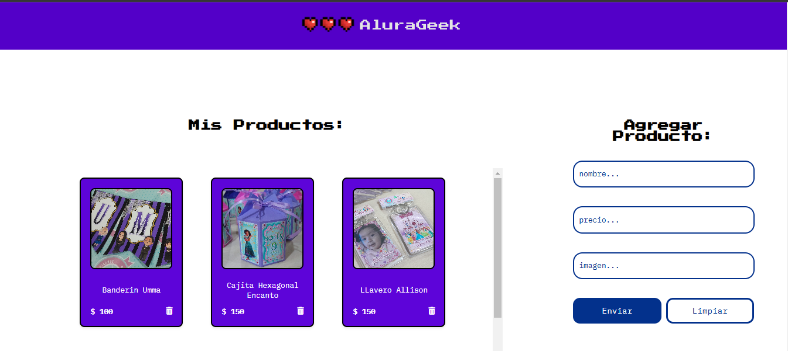

AluraGeek

Descripción
AluraGeek es un proyecto desarrollado para el desafío AluraGeek de Alura LATAM. Esta aplicación web permite a los usuarios agregar, ver y eliminar productos en una tienda en línea.

Características
Mostrar una lista de productos con sus detalles (nombre, precio, imagen).
Agregar nuevos productos a la lista.
Eliminar productos existentes de la lista.
Tecnologías Utilizadas
Frontend:

HTML
CSS
JavaScript
Backend:

JSON Server (para simular una API REST)

Instalación

Clonar el repositorio
git clone https://github.com/MabyDiaz/proyecto-alurageek.git
cd alurageek

Instalar dependencias
npm install

Ejecutar JSON Server
npx json-server --watch productos.json --port 3001

Uso
Abre challenge_aluraGeek.html en tu navegador.
Agrega productos usando el formulario.
Elimina productos haciendo clic en el ícono de basura en cada tarjeta de producto.
Estructura del Proyecto
assets/: Contiene las imágenes del proyecto.
js/: Contiene el archivo JavaScript principal (app.js).
node_modules/: Contiene los módulos y dependencias instalados con npm.
challenge_aluraGeek.css: Archivo CSS para los estilos.
challenge_aluraGeek.html: Archivo HTML principal.
productos.json: Archivo JSON que contiene los datos de los productos.
server.js: Archivo del servidor que maneja las peticiones a los productos.
package.json: Archivo de configuración de npm que incluye las dependencias.
README.md: Archivo con la descripción y documentación del proyecto.
Contribuciones
Si deseas contribuir a este proyecto, por favor sigue los siguientes pasos:

Haz un fork del repositorio.
Crea una nueva rama (git checkout -b feature/nueva-funcionalidad).
Realiza tus cambios y haz commit (git commit -am 'Agrega nueva funcionalidad').
Sube tus cambios (git push origin feature/nueva-funcionalidad).
Abre un Pull Request.
